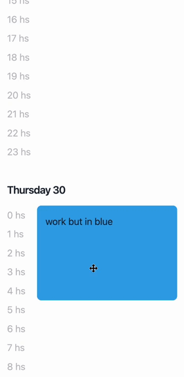

# Headless calendar for react

A zero dependency library for react, with unstyled and controlled components to build your own agenda. Simple to use while allowing fully customization (markup is all yours!)

🔧 Flexible

✅ Controlled

🚀 Performant

🤯 Unstyled

↔️ Support for dragging and resizing events

<br>

## [📖 All examples and documentation here!](https://react-headless-calendar.vercel.app/)

<br>

## 🚧🚧 This repo is under heavy development 🚧🚧

<br>

Use your markup and custom logic to achieve virtually anything!


A bit of [framer-motion](https://www.framer.com/motion/) was used to make the navigation look smooth - [See code](https://github.com/lucassaid/react-headless-agenda/blob/main/stories/full-examples/LimitIsTheSky.stories.tsx)

<br>

You can easily adapt it for mobile!
<br>



<br>

# Installation

```bash
npm i react-headless-calendar
```

```bash
yarn add react-headless-calendar
```

```bash
pnpm add react-headless-calendar
```

<br>
<br>

# Usage

All examples use [date-fns](https://www.npmjs.com/package/date-fns) but you can use the library of your choice to manipulate dates.

## `<Agenda>`

Our parent component. Just provide a start day, and some events.

```tsx
import { startOfWeek, addHours }  from 'date-fns'

// only `start` and `end` are required!
const events = [
  {
    id: 'event1',
    someTitle: 'Hey there!',
    start: new Date(),
    end: addHours(new Date(), 5),
  }
]

<Agenda
  startDate={startOfWeek(new Date())}
  events={events}
/>
```

This is a controlled component. The agenda will NOT have an "inner" state in sync with `events` or `startDate`. Instead, it will fire an event for you to update your state when needed.

<br>

## `<Days>`

It lets you render whatever you need to, for each day. For example, let's render its name and number:


```tsx
import { format } from 'date-fns';

<div className="flex">
	<Days>
		{({ date }) => (
			<div key={date.toString()} className="flex-1">
				{format(date, 'ccc d')}
			</div>
		)}
	</Days>
</div>;
```

<br>

Now the fun part, render your events!


```tsx
// `events` is an array containing only the events for the current day
<Days>
	{({ date, containerRef, events }) => (
		<div key={date.toString()} ref={containerRef} className="relative h-full">
			{events.map(({ event, top, bottom }) => (
				<div className="absolute w-full rounded-lg p-4" style={{ top, bottom }}>
					{event.someTitle}
				</div>
			))}
		</div>
	)}
</Days>
```

<br>
<br>

That's it! You also have `<Time>`, `<Needle>`, and `<Crosshair>`, but you'll learn them as you go.

---

PR's are welcome!
